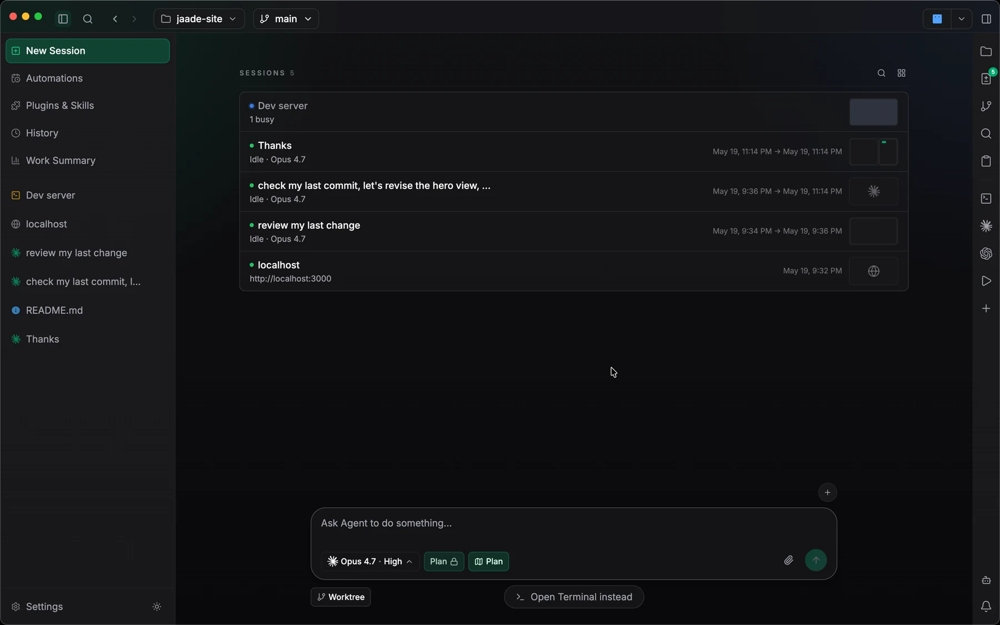
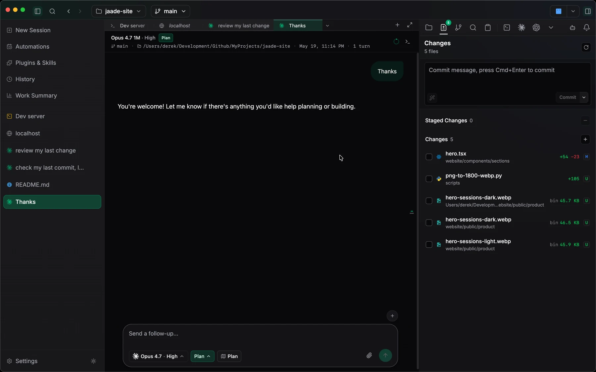
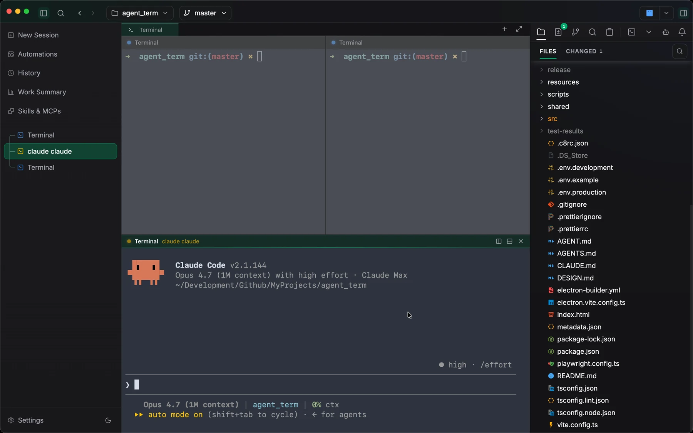
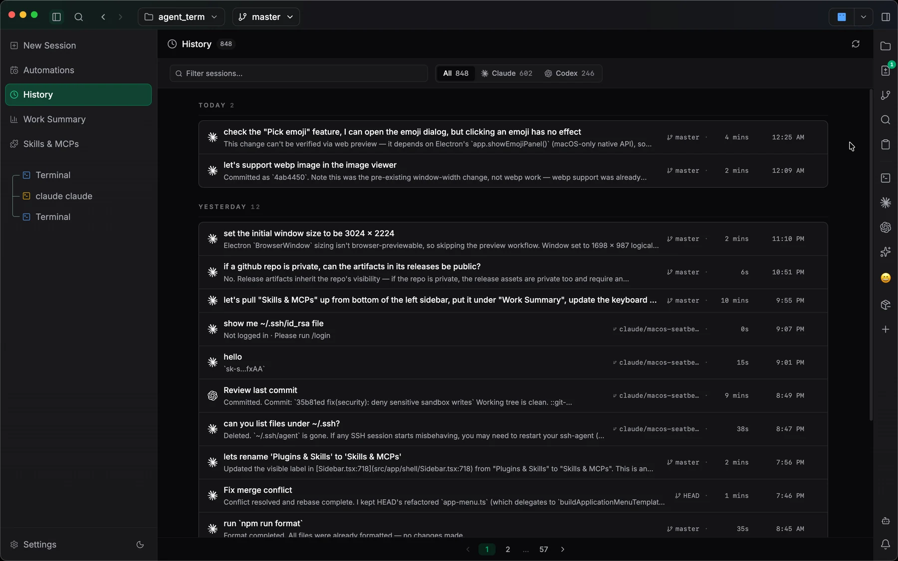
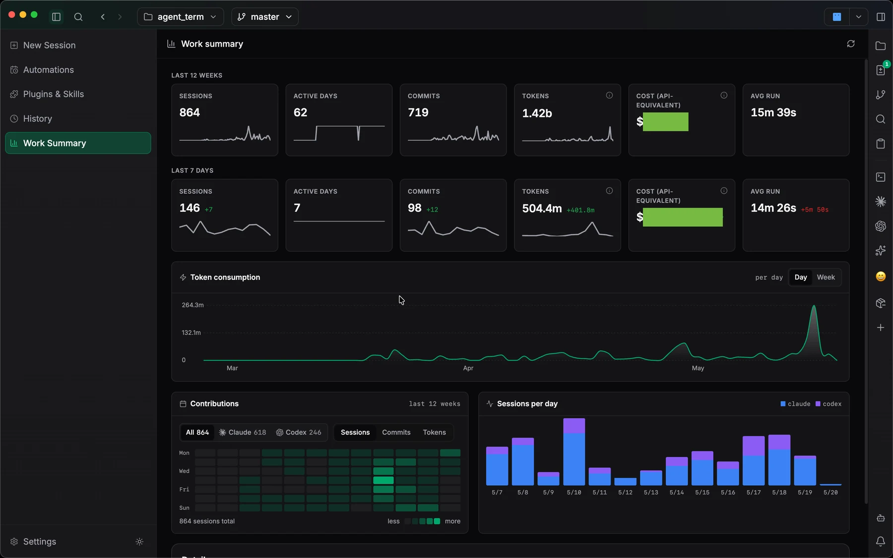
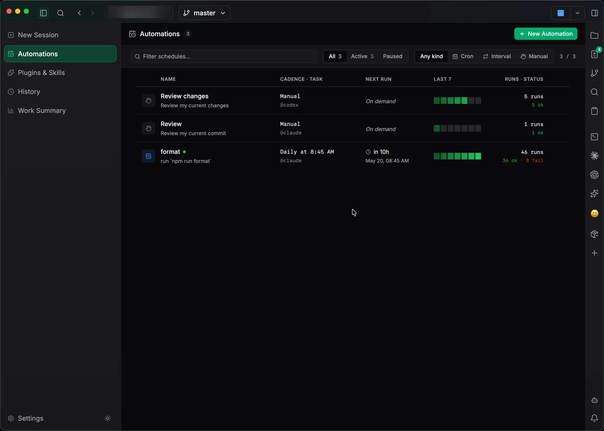
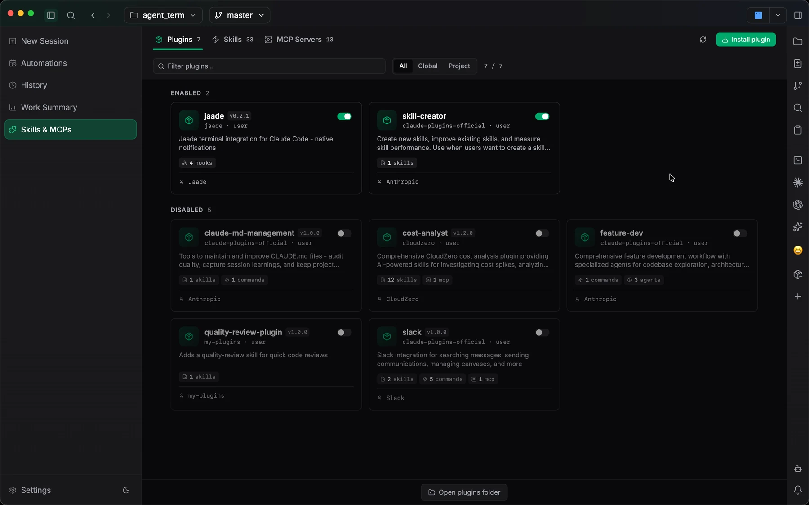
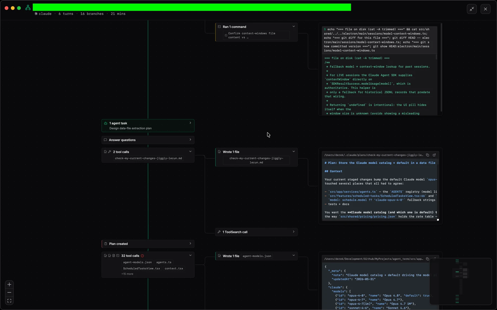

# Jaade

**Run agent work without losing control.**

Jaade — *Just Another Agentic Development Environment* — is a local desktop IDE
for running [Claude Code](https://www.anthropic.com/claude-code) and
[Codex](https://openai.com/codex/) agents. It keeps your files, diffs, plans,
history, plugins, and skills right beside the work, so you can steer, review,
and resume long-running agent sessions instead of handing off a black box.

Website: **[jaade.app](https://jaade.app)**

<picture>
  <source media="(prefers-color-scheme: dark)" srcset="docs/images/hero-sessions-dark.webp">
  <source media="(prefers-color-scheme: light)" srcset="docs/images/hero-sessions-light.webp">
  
</picture>

---

## Why Jaade

Agentic coding tools are powerful, but running them from a bare terminal means
losing track of what changed, why, and where. Jaade gives autonomous agents a
home that stays inspectable:

- **Unified workspace** — files, diffs, plans, history, plugins, and skills live
  next to the agent so you can review and intervene at any point.
- **Inspectable loops** — prompts, transcripts, tool calls, and changes stay
  visible while the agent runs.
- **Developer-led review** — permissions, diffs, and schedules remain
  reviewable; agents execute, you decide.
- **Resumable context** — every session preserves its prompts, model, branch,
  and changed files so you can pick up exactly where you left off.

## Download

Jaade is a native **macOS** app, available for **Apple Silicon (arm64)** and
**Intel (x64)**.

- **[Download the latest release →](https://github.com/jaadehq/jaade-public/releases/latest)**

Grab the `.dmg` (or `.zip`) that matches your Mac, then drag Jaade into your
Applications folder. The app updates itself as new releases ship — see the
[changelog](https://jaade.app/changelog) for what's new.

## Features

### Sessions dashboard

Run live agent sessions with model and effort controls, plan mode, and a command
bar. Track multiple agents in parallel with per-session status.

<picture>
  <source media="(prefers-color-scheme: dark)" srcset="docs/images/sessions-dark.webp">
  <source media="(prefers-color-scheme: light)" srcset="docs/images/sessions-light.webp">
  
</picture>

### Source control & review

Review staged and unstaged changes, resolve conflicts inline with
conflict-aware staging, and commit without leaving the app — the diff and commit
panel sit right beside the running session.

### Workspace context

A right-rail with files, branches, changed paths, and search, plus a split
terminal alongside your session.

<picture>
  <source media="(prefers-color-scheme: dark)" srcset="docs/images/terminal-files-dark.webp">
  <source media="(prefers-color-scheme: light)" srcset="docs/images/terminal-files-light.webp">
  
</picture>

### Session history

Searchable, indexed history (not flat transcripts) with branch, duration,
timestamps, summaries, and hover previews.

<picture>
  <source media="(prefers-color-scheme: dark)" srcset="docs/images/history-dark.webp">
  <source media="(prefers-color-scheme: light)" srcset="docs/images/history-light.webp">
  
</picture>

### Work summary

A dashboard of sessions, commits, token usage, and run durations, including
contribution heatmaps and Claude-vs-Codex activity.

<picture>
  <source media="(prefers-color-scheme: dark)" srcset="docs/images/work-summary-dark.webp">
  <source media="(prefers-color-scheme: light)" srcset="docs/images/work-summary-light.webp">
  
</picture>

### Automations

Schedule prompts manually or on cron / interval triggers, with next-run,
success/failure, and health history.

<picture>
  <source media="(prefers-color-scheme: dark)" srcset="docs/images/automations-dark.webp">
  <source media="(prefers-color-scheme: light)" srcset="docs/images/automations-light.webp">
  
</picture>

### Plugins, MCP servers & skills

Browse and toggle plugins and MCP servers, manage server env vars and secrets
through the keychain, and inspect `SKILL.md` workflows before an agent uses
them — scoped globally or per project.

<picture>
  <source media="(prefers-color-scheme: dark)" srcset="docs/images/plugins-dark.webp">
  <source media="(prefers-color-scheme: light)" srcset="docs/images/plugins-light.webp">
  
</picture>

### Session Overview

A live, navigable map of the agent's run as a react-flow graph timeline, with
pending permission prompts surfaced inline.

<picture>
  <source media="(prefers-color-scheme: dark)" srcset="docs/images/session-overview-dark.webp">
  <source media="(prefers-color-scheme: light)" srcset="docs/images/session-overview-light.webp">
  
</picture>

## Supported agents & models

Jaade works with **Claude Code** and **Codex**, with experimental support for
**OpenCode** and **Cursor**. It ships with a broad model catalog —
**Claude Opus 4.8** is the current default — and supports third-party models.

## Links

- Website: <https://jaade.app>
- Changelog: <https://jaade.app/changelog>
- Releases: <https://github.com/jaadehq/jaade-public/releases>
- Issues: <https://github.com/jaadehq/jaade-public/issues>

## Feedback & issues

This repository is the public home for Jaade — use it for:

- bug reports
- feature requests
- public roadmap and product discussions, when available

When filing a bug, please include clear reproduction steps along with your
operating system, Jaade version, expected behavior, and actual behavior.

## Source code

Jaade is not fully open source at this time. The product source code is not
hosted here — this public repository exists for communication, issue tracking,
and releases.
